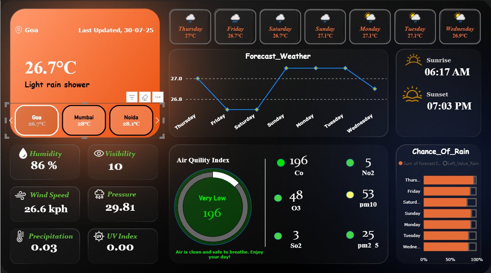
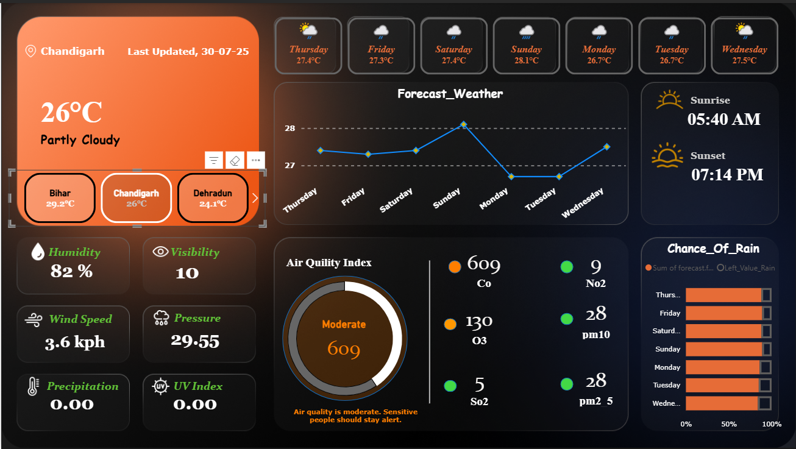
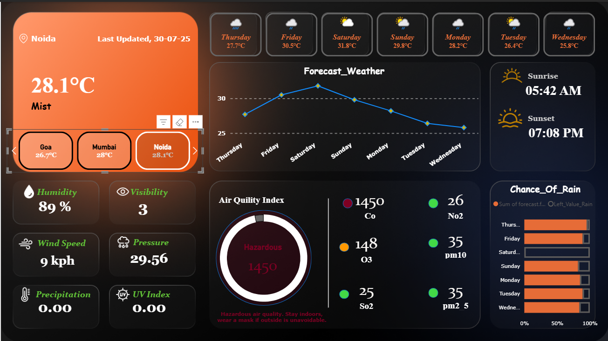

## 🌦️ Live Weather Dashboard (Power BI)

A fully interactive Weather Dashboard built in Power BI, using live data fetched from WeatherAPI (12-day trial).
All data cleaning, transformation, and modeling is done in Power Query, and the final dashboard visualizes temperature, humidity, AQI, chances of rain, forecast trends, and more — in a clean and modern UI.

## 📸 Dashboard Screenshots

## Goa

  

## Chandigarh

  

##  Noida

  

📌 Project Overview

## This dashboard displays:

🌡️ Current Temperature & Feels Like

🌧️ Weather Conditions (Rain, Clouds, Clear, etc.)

📅 7-Day Forecast

🎯 Chance of Rain (%) per day

💨 Wind Speed, Humidity, Pressure, Visibility

🌅 Sunrise & Sunset Time

🟢 Air Quality Index (AQI) Gauge

🏙️ City Selector Cards (Goa, Mumbai, Noida, etc.)

The dashboard layout is designed with bold colors, smooth gradients, and card-based UI for a clean and professional look.

## 🛠️ Tools & Technologies
Purpose	Tool
Data Source	🌐 WeatherAPI
Cleaning / ETL	⚙️ Power Query (M Language)
Dashboard Design	📊 Power BI Desktop
File Format	.pbix
🔗 Data Source

Data fetched from: https://api.weatherapi.com/v1/current.json?key=YOUR_API_KEY&q=cityName

## ⚠️ The WeatherAPI key used in this project was a 12-day trial, so refresh will not work after expiry unless a new key is added.

▶️ How to Open the Dashboard

Download or clone this repository

Open Weather dashboard.pbix using Power BI Desktop

Interact with filters, cards, visuals

(Optional) Add your own WeatherAPI key in Power Query to refresh data

## 🚀 Features

✔️ Clean UI with gradient background
✔️ Daily forecast visualization
✔️ AQI gauge design
✔️ Interactive city cards
✔️ Auto-updated date & time
✔️ Chance of rain bar chart
✔️ Easy to customize for multiple cities

## 🎯 Future Improvements

⏱️ Add historical weather data
🌍 Add map-based weather layers
🔄 Auto-refresh using scheduled refresh (API + gateway required)
📱 Create a dedicated mobile layout

✨ Author

Sumit Bhatt
GitHub: https://github.com/sumiT-bhATT-443
